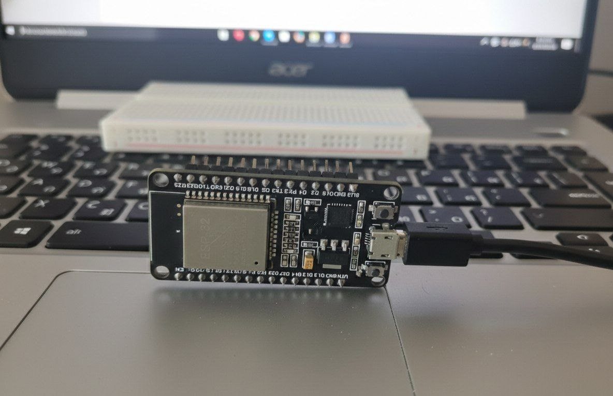
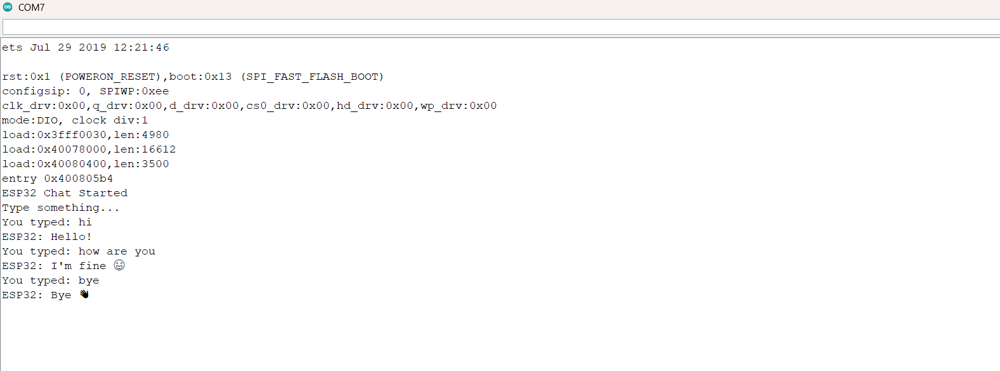

# 📟 ESP32 USB Serial Chat System

A simple beginner-friendly project that demonstrates **serial communication** between an **ESP32** and a **computer** using a **USB cable**.  
This project helps understand how data is sent and received through the **Arduino Serial Monitor**.

---

## 🌟 How It Works

1. The **ESP32 is connected to the computer via USB**
2. The user types a message in the **Arduino Serial Monitor**
3. The ESP32 reads the incoming message
4. The ESP32 sends a response back
5. The conversation appears in real time on the Serial Monitor

---

## 🔌 The Connection

This project requires **no external components**.  
The ESP32 is powered and communicates **only through the USB cable**.

---

## 📍 Hardware Used

| Component | Description |
|---------|-------------|
| ESP32 | Main microcontroller |
| USB Cable | Power and data communication |
| PC / Laptop | Serial monitor interface |

---

## 🖥️ Output

All messages and responses are displayed in the **Arduino Serial Monitor**.

---
